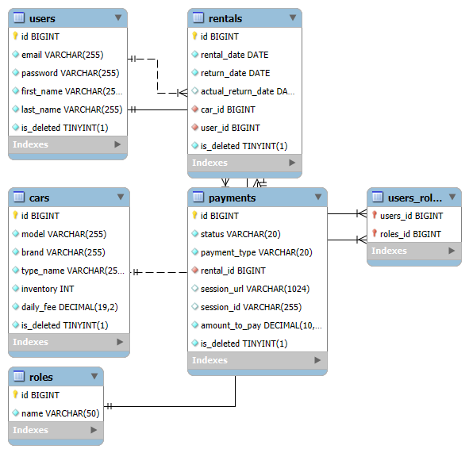

## 🚗 Car Sharing API 🚗

### Intro
Welcome to the Car Sharing Service Backend — a scalable, modular RESTful API built with Java and Spring Boot.
This project powers a comprehensive car sharing management system, offering endpoints to manage users, cars, rentals, payments, and other core functionalities, all while ensuring strong security and thorough documentation.
The main technology behind the project is Java and Spring Boot. It has all the necessities of a modern day Web application, an online car sharing service in particular. Let me show you the details!
The system is designed following a Layered Architecture, which ensures clear separation of concerns, easier maintenance, and future scalability.
It integrates modern backend technologies and tools to simplify development, improve testing and deployment processes, and enhance security.
---
### Challenges faced
 - Configuring Docker to work with an existing MySQL database running inside a container
 - Setting up and mastering MapStruct configuration
 - Integrating Stripe payment processing with secure handling of payment sessions
 - Implementing Telegram notifications for rental management
---
### Tech stack
- Java 17
- Spring Boot 3.4.3
- Spring Data JPA 3.4.3
- Spring Security 6.4.3
- MySql 8.0.33
- Docker 3.4.1
- Mapstruct 1.6.3
- Swagger
- Stripe API (Payment Processing)
- Telegram Bot API (Notifications)
---
### Functionality
1. Registration, authentication and authorization:
    - User registration (`POST /auth/registration`) and login (`POST /auth/login`) endpoints are provided.
    - JWT token after successful login
    - Roles functionality (Admin and User(customer)).
    - The fields of both requests are validated By Hibernate validator!
2. User management:
    - Managers can update user roles (`PUT /users/{id}/role`). 
    - Users can view and update their profile (`GET /users/me`, `PUT /users/me`).
3. Car management (CRUD):
    - Admin users have permissions to create (`POST /cars`), update (`PUT /cars/{id}`), and delete (`DELETE /cars/{id}`) cars in the fleet.
    - As a customer/user, I am able to see all cars (`GET /cars`), search by car id (`GET /cars/{id}`).
4. Rental management:
    - Users can create new rentals (`POST /rentals`) which automatically decreases car inventory.
    - View rentals with filtering options (`GET /rentals/?user_id=...&is_active=...`).
    - Retrieve specific rental details (`GET /rentals/{id}`).
    - Return rentals (`POST /rentals/{id}/return`) which increases car inventory.
    - Admin users can view all rentals, customers can only see their own.
5. Payment processing (Stripe integration):
    - View payments with role-based access (`GET /payments/?user_id=...`).
    - Create payment sessions for rentals and fines (`POST /payments/`).
    - Handle successful payments (`GET /payments/success/`).
    - Handle cancelled payments (`GET /payments/cancel/`).
    - Automatic fine calculation for overdue rentals.
6. Notification system (Telegram):
    - Automatic notifications for new rental creation.
    - Daily scheduled checks for overdue rentals.
    - Notifications sent to administrators via Telegram bot.
---
### EER Diagram

---
### How to run and build the project locally
- Install:
    - Java 17
    - Maven
    - MySQL
    - Docker
- Clone the repository
- Create an env file (a template is provided, see "env.template" file)
- Create an application.properties file (a template is provided, see "application.properties.template" file)
- Run the following commands:
```
mvn clean install
docker-compose build
docker compose up
```
- Launch Swagger locally via the
```
http://localhost:8080/swagger-ui/index.html
```

###  Fork and Clone a Project on GitHub

Forking creates a personal copy of someone else's repository under your GitHub account.

- [Go to the GitHub page of repository](https://github.com/yaroslav-pryshchepa/car-sharing-app)
- Click the "Fork" button in the upper-right corner
- Select your GitHub account (or organization) to create the fork

  You now have your own copy of the project.

Make sure you have Git installed on your machine

- You can check by running:
```
git --version
```

Cloning downloads your forked project to your local machine so you can run or work on it.

- On your forked repository page (on your GitHub account), click the "Code" button
- Copy the URL under HTTPS or SSH
- Open a terminal (or Git Bash) on your computer
- Run the following command
```
git clone https://github.com/yaroslav-pryshchepa/car-sharing-app.git
```

---

## Postman Collection

You can find a Postman collection in `car-sharing-app-api.postman_collection.json`. To use this:

1. Import the file into Postman.
2. Adjust Authorization headers (use JWT obtained from login endpoint).
3. Test all exposed APIs such as authentication, book management, and more.

---
